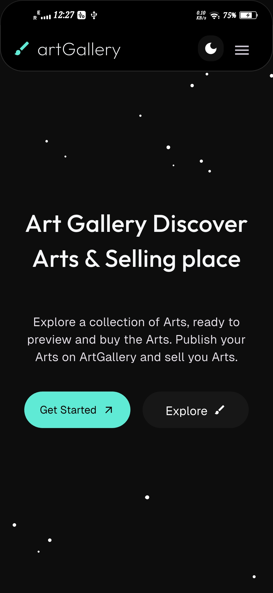
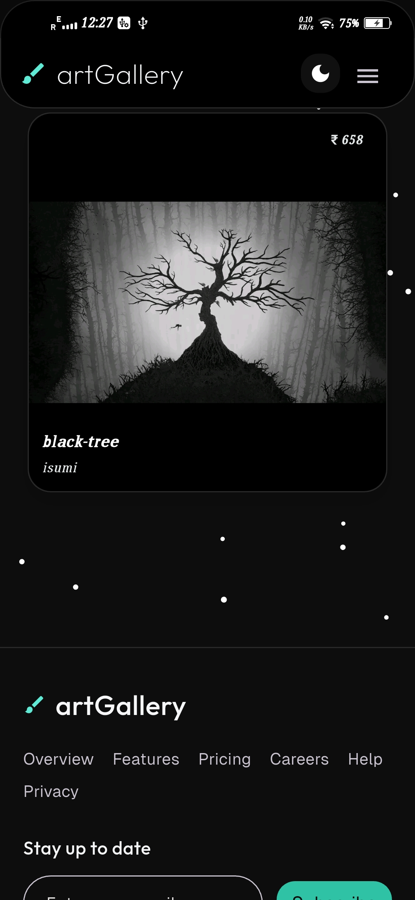
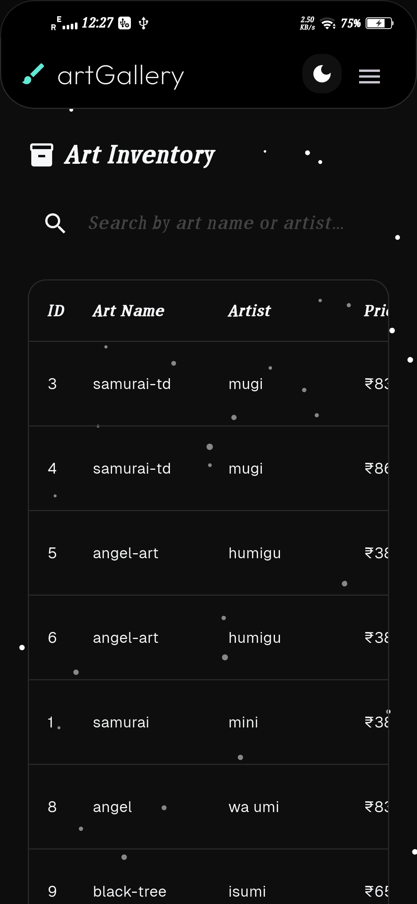
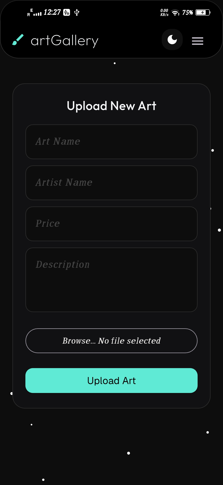
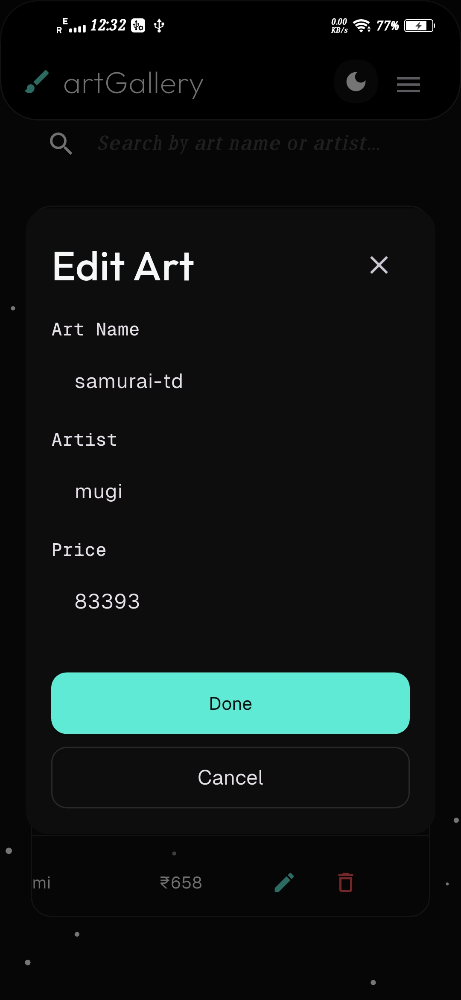
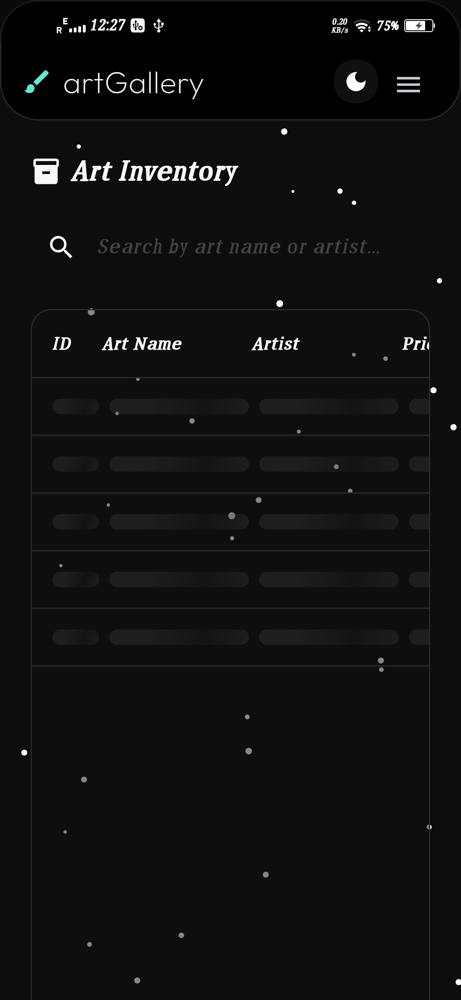

# 🎨 Art Gallery

A modern, high-performance Flutter application designed for showcasing and managing digital art. Built with a focus on clean UI/UX, reusable component architecture, and a scalable layout system inspired by modern web frameworks.

---

## 📸 Screenshots

| Home Page | Gallery View | Inventory Management |
| :---: | :---: | :---: |
|  |  |  |

| Upload Art | Edit Dialog | Table Skeletons |
| :---: | :---: | :---: |
|  |  |  |

---

## ✨ Key Features

- **🌐 Cross-Platform**: Optimized for Web and Mobile with responsive layouts.
- **🌗 Dynamic Theming**: Full support for Light and Dark modes with a custom token-based system.
- **🖼️ Art Gallery**: Browse a beautiful collection of arts with smooth image loading and shimmer effects.
- **📋 Inventory CRUD**: Comprehensive management system to add, edit, and delete art pieces.
- **🚀 Advanced Loading States**: Custom shimmer skeletons for both gallery cards and table rows.
- **📱 Responsive Shell**: Global layout system featuring a fixed navbar, drawer, and unified footer.
- **🔍 Search & Filter**: Real-time filtering in the inventory system for quick access.

---

## 🛠️ Tech Stack

- **Framework**: [Flutter](https://flutter.dev) (v3.x)
- **State Management**: StatefulWidgets & ValueNotifier for lightweight performance.
- **Routing**: [GoRouter](https://pub.dev/packages/go_router) for declarative, web-friendly navigation.
- **Networking**: [http](https://pub.dev/packages/http) with Multipart support for image uploads.
- **Theming**: Custom `ThemeExtension` for scalable design tokens (Shadcn/Tailwind inspired).

---

## 📂 Project Structure

```bash
lib/
├── api/                # API models and service layers
├── app/                # Global shell and app entry
├── config/             # Environment configurations
├── core/
│   ├── routes/         # GoRouter configuration
│   ├── theme/          # Custom theme tokens and extensions
│   └── widgets/        # Reusable global UI components
└── pages/              # Feature-based page implementations
    ├── art/            # Gallery display
    ├── home/           # Landing page
    ├── inventory_page/ # CRUD management
    └── publisharts/    # Art upload form
```

---

## 🚀 Getting Started

### Prerequisites
- Flutter SDK (^3.10.4)
- Dart SDK

### Installation

1. **Clone the repository**
   ```bash
   git clone https://github.com/aswin402/artgallery.git
   cd artgallery
   ```

2. **Install dependencies**
   ```bash
   flutter pub get
   ```

3. **Configure Environment**
   Check `lib/config/env.dart` to ensure the API URL matches your backend environment.

4. **Run the application**
   ```bash
   flutter run
   ```

---

## 🧪 Development Highlights

- **Web-Inspired Layout**: Uses an `AppShell` (similar to Next.js layouts) to wrap all routes with a consistent Navbar and Footer.
- **Custom Shimmers**: Hand-crafted shimmer animations using `TweenAnimationBuilder` without external heavy libraries.
- **Multipart Uploads**: Robust handling of image uploads for both Web (bytes) and Native (file paths).

---


## 📄 License

This project is licensed under the MIT License - see the LICENSE file for details.
